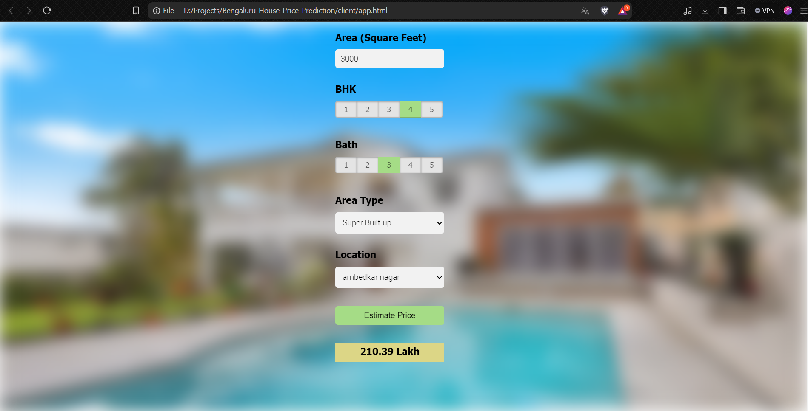
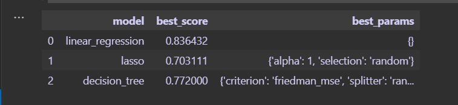

# Bangalore House Price Prediction



This repository contains a project for predicting house prices in Bangalore using machine learning techniques.

## Overview

This project aims to predict house prices in Bangalore based on historical data. It utilizes features such as number of bedrooms (bhk), location, area type, total square feet, number of bathrooms, and number of balconies to build predictive models.

## Dataset

The dataset used in this project is sourced from [Kaggle](https://www.kaggle.com/datasets/anitakataria/bengaluru-house-dataset).

## Technologies Used

- Python
- Pandas, NumPy, Scikit-learn, Matplotlib
- Jupyter Notebook (for data exploration and modeling)
- Nginx, AWS (for cloud hosting and deployment)

## File Descriptions

- `model.ipynb`: Jupyter notebook containing code for data preprocessing, model training, and evaluation.
- `bangalore_home_prices_model.pickle`: Pickle file containing the trained machine learning model.

## Usage

To run the Bangalore House Price Prediction application locally using Nginx, follow these steps:

1. **Start the Flask Server:**
   - Navigate to the server directory where `server.py` is located.
   - Start the Flask server using the following command:
     ```bash
     python server.py
     ```
   This will start your Flask server on `http://localhost:5000`.

2. **Configure Nginx:**
   - Open your Nginx configuration file (`nginx.conf`). Modify the configuration to proxy requests to your Flask server:
     ```
     server {
         listen       80;
         server_name  localhost;

         location / {
             proxy_pass http://localhost:5000;
             proxy_set_header Host $host;
             proxy_set_header X-Real-IP $remote_addr;
             proxy_set_header X-Forwarded-For $proxy_add_x_forwarded_for;
             proxy_set_header X-Forwarded-Proto $scheme;
         }
     }
     ```

3. **Start Nginx:**
   - Start Nginx by running `nginx.exe` from the command line.

4. **Access the Application:**
   - Open your web browser and navigate to `http://localhost`. This will display the Bangalore House Price Prediction application.

5. **Client Setup:**
   - Ensure your client (e.g., HTML file `app.html`) is configured to make requests to `http://localhost` for data and predictions.

6. **Making Predictions:**
   - Use the application interface to input data and obtain predictions for house prices in Bangalore.

7. **Stopping the Servers:**
   - To stop the Flask server, terminate the process in the terminal.
   - To stop Nginx, execute `nginx.exe -s stop` from the command line.

## Results

### Model Performance Metrics

- **Model Scores:**
  
  
- **Error Metrics (RMSE and MAE):**
  

The model achieved competitive scores in RMSE and MAE, indicating its effectiveness in predicting house prices.

## Future Improvements

In the future, improvements could include:
- Exploring ensemble methods for improved prediction accuracy.
- Incorporating additional relevant features such as property age or neighborhood amenities.
- Optimizing model hyperparameters for better performance.

## License

This project is licensed under the MIT License.

## Acknowledgements

This project was inspired by a coding challenge from Codebasics. [Link to Codebasics](https://www.youtube.com/playlist?list=PLeo1K3hjS3ut2o1ay5Dqh-r1kq6ZU8W0M).

## Contact

For questions or collaborations, please reach out at madhurdixit37@gmail.com.
